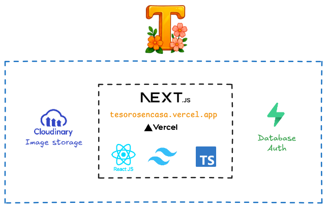

**Tesoros en Casa** es una aplicación web que ofrece un catálogo de antigüedades únicas.

## Motivación

El objetivo de este proyecto es proporcionar un soporte digital para Tesoros en Casa, de modo que la interfaz permita previsualizar todas las antigüedades antes de su venta, facilitando así una idea más clara de lo que se busca al asistir al evento en vivo.

## Propiedades

- **Catálogo de antigüedades:** Lista de productos anticipada que se van a promocionar en la venta
- **Recordatorio sobre la próxima venta:** Anuncio informativo sobre la fecha de la próxima venta en directo

## Arquitectura

## Tecnologías utilizadas

- Desarrollado en **Next.js 15** como Framework principal.
- **React 19**: Librería de JavaScript para construir la interfaz de usuario.
- **Tailwind CSS 3**: Framework de utilidades para diseño responsivo y estilizado rápido.
- **Zustand**: Manejo de estado global sencillo.
- **Prisma**: ORM para interactuar con la base de datos de manera segura y eficiente.
- **Supabase**: Backend como servicio, incluyendo autenticación y almacenamiento.
- **Cloudinary**: Gestión y optimización de imágenes en la nube.
- **Next-Intl**: Soporte para internacionalización.
- **Prettier & ESLint**: Formateo y linting de código para mantener calidad y consistencia.

## Setup del proyecto

Sigue los pasos para configurar y ejecutar el proyecto en tu entorno local desde [docs/setup.md](./docs/setup.md)
